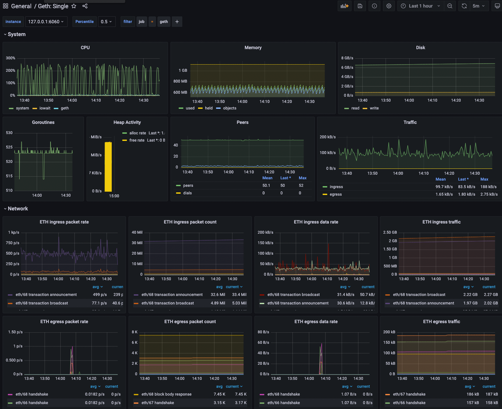

# Validation Cloud Tech Challenge
This repository contains code that will create infrastructure for running a Geth node in AWS.

## Architecture


## Part 1
----------------------------------------------------------------------------------------------------------------

### Prerequisites
The following must be installed in order to run and use the content in this repository:
* [Terraform](https://www.terraform.io/)
* [Golang](https://go.dev/)
* [AWS CLI](https://aws.amazon.com/cli/)
* An AWS account that you own

### IAM Permissions
You must have an IAM user that you are able to authenticate with from your local machine. To configure the IAM user for programmatic access, please follow the steps outlined in [this documentation](https://docs.aws.amazon.com/IAM/latest/UserGuide/id_users.html). The following permissions are needed to deploy the infrastructure:
* AmazonEC2FullAccess
* AWSGrafanaAccountAdministrator
* AWSGrafanaWorkspacePermissionManagement
* CloudWatchLogsFullAccess
* IAMFullAccess
* Inline Policy called `sso`:
```
{
    "Version": "2012-10-17",
    "Statement": [
        {
            "Sid": "VisualEditor0",
            "Effect": "Allow",
            "Action": [
                "sso:CreateManagedApplicationInstance",
                "sso:DeleteManagedApplicationInstance"
            ],
            "Resource": "*"
        }
    ]
}
```

* Inline Policy called `ssm`:
```
{
    "Version": "2012-10-17",
    "Statement": [
        {
            "Sid": "VisualEditor0",
            "Effect": "Allow",
            "Action": "ssm:StartSession",
            "Resource": "*",
            "Condition": {
                "StringEquals": {
                    "aws:ResourceTag/Name": "geth-node"
                }
            }
        }
    ]
}
```

### SSO User
To access the Grafana dashboard, you must create an SSO user that you will log into and give Admin privileges to Amazon Managed Grafana. You can do that by following the information outlined in [this documentation](https://docs.aws.amazon.com/singlesignon/latest/userguide/addusers.html).


### Usage

1. Run `terraform init` to initialize the Terraform modules into your local state.
2. Create a `terraform.tfvars` file to specify the parameters you would like to use. You can find the SSO ID of the user created above by doing the following: 
  - Log into your AWS Console.
  - Navigate to the IAM Identity Service.
  - Click "Users" on the left side of the screen.
  - Click the user (or users) you would like to make administrators of your Grafana instance.
  - Copy the `User ID` value and input it into a list object into the `terraform.tfvars`.

  An example of a `terraform.tfvars` file is below:

  ```
  cloudwatch_logs_group_name = "geth-node"
  sso_user_ids               = ["90675d91f3-f38de10e-4c5e-4d9a-86ce-2a310c19bd01"] # not my real ID
  ```
3. Run `terraform plan` and ensure that the plan correctly states it will do what you want (it should).
4. Run `terraform apply` and click yes. This will create the infrastructure!
5. Watch everything come up (it takes around 6-7 minutes).


### Outputs
Upon successful deployment, you should see a list of outputs that Terraform will show you. We will be using these later so take note of them.

```
grafana_workspace_endpoint = "g-7234783b1f.grafana-workspace.us-east-1.amazonaws.com"
grafana_workspace_id = "g-7234783b1f"
private_ip = "10.5.10.120"
public_ip = "54.163.60.134"
```

### Monitoring
Inside the `scripts/` directory you will find the `bootstrap_grafana.sh` script, which automatically creates the datasource and dashboard for Geth. The dashboard is a premade template that is copied from [this site](https://grafana.com/grafana/dashboards/18290-geth-single/). To log in, please perform the following steps:

1. Copy the `grafana_workspace_endpoint` terraform output and browse to it.
2. Log in using the SSO username and password created previously.
3. On the left side of the screen, mouse over the dashboard logo and click "browse".
4. Double-click the dashboard that says "Geth: Single". It should look something like the below:




### Logging
[Vector](https://vector.dev/) has been installed on the node as a way to collect logs and export them into cloudwatch logs. The logs will be in Cloudwatch Logs under the group name you specify in the parameters. The log streams are as follows:

* prysm
* vector
* geth
* prometheus


### Logging in to the Instance
The SSH port is disabled, however, you can use [AWS Systems Manager](https://docs.aws.amazon.com/systems-manager/latest/userguide/session-manager.html) to log in. It is recommended to install the [plugin](https://docs.aws.amazon.com/systems-manager/latest/userguide/session-manager-working-with-install-plugin.html) first, and then log in using the following AWS CLI command:
* `aws ssm start-session --target <instance_id>`

## Part 2
----------------------------------------------------------------------------------------------------------------------

### Run Go Program
The program `main.go` is to be used to check the node's connected peers. To use the program, use it like so:
1. `go build`
2. `./geth-node-peers -ip=<node_public_ip>` where `node_public_ip` is the public IP address of the geth node as listed in the Terraform output.
